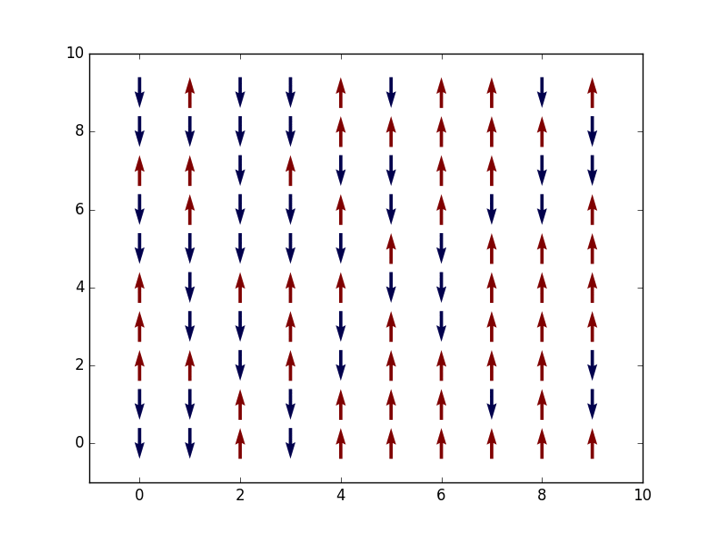
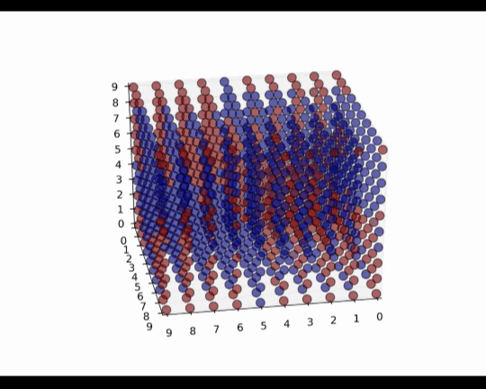

# Monte Carlo Simulations on Magnetic Phase Transition.

This project is to use Markov Chain Monte Carlo method to simulate the behavior of spin orders in magnetic materials.

### Methods

**Monte Carlo Methods** are a broad class of computational algorithms that rely on repeated random sampling to obtain numerical results. Their essential idea is using random samples to solve problems that might be deterministic in principle. In physics-related problems, Monte Carlo methods are useful for simulating systems with many coupled degrees of freedom, for example, our spin interacting system. Here we introduce a specific Monte Carlo method — Markov Chain Monte Carlo (MCMC).

- Markov Chain Monte Carlo (MCMC) 

  Markov Chain is a dependent system, the next state of the system depends only on the present state:
  $$
  P(x) = P(x_k|x_{k-1})P(x_{k-1}|x_{k-2})...P(x_2|x_1).
  $$
  All the probabilities are forming a transition matrix, which can be shown as a transition diagram, e.g. a 3-states transition matrix:
  $$
  P =  \left[ {\begin{array}{ccc}   P_{11} & P_{12} & P_{13} \\   P_{21} & P_{22} & P_{23} \\ P_{31} & P_{32} & P_{33} \end{array} } \right].
  $$
  each element in the matrix represents the possibility from one state to the other one.

  MCMC is simply to construct a Markov chain to do Monte Carlo approximation, the most used algorithm is Metropolis–Hastings Algorithm.

- Metropolis–Hastings Algorithm

  The Algorithm is illustrated as the pseudocode:

  1. Initialize $x_0$

  2. For  $i$ = 0  to $N$

     - Sample $u$ ~ $U(0, 1)$

     - Sample $x^*$ ~ $q(x^*|x_i)$

     - If $u < A(x_i, x^*) = min\{1, p(x^*)q(x_i|x^*) / p(x_i)q(x^*|x_i)\}$

       ​	$x_{i+1} = x^*$

       else

       ​	$x_{i+1} = x^*$

The implemental details of MCMC in a magnetic lattice can be referred to

[**MCMC implementation.ipynb**](https://nbviewer.jupyter.org/github/RuihaoQIU/MC-Magnetic-Phase-Transition/blob/master/MCMC%20implementation.ipynb)

### Models

- **Mean-field Theory**

  For an individual particle in a many-body system, the effect from all the other particles is approximated by a single averaged effect, which reducing a many-body problem to a one-body problem.

  We call it Mean-field Theory.

  First, we use Mean-field Theory to estimate the Néel temperature of the magnetic system, please refer to (Attention, lots of formulas!!!)

  [**Mean-field Theory.ipynb**]()

- **Ising Model**

  - 2D Ising Model

    In 2D Ising model, the spins are lying in $xy$-plane and oriented only along either +$y$ or -$y$ directions. The following figure shows the Monte Carlo process.

    

    The codes and other details are in the following page:

    [**2D-Ising-model.ipynb**](https://nbviewer.jupyter.org/github/RuihaoQIU/MC-Magnetic-Phase-Transition/blob/master/2D-Ising-model.ipynb)

    ​

  - 3D Ising model

    

  ​

  [3D Ising Model](https://nbviewer.jupyter.org/github/RuihaoQIU/MC-Magnetic-Phase-Transition/blob/master/3D-Ising-model.ipynb)

- **Heisenberg Model**

  [3D Heisenberg Model](https://nbviewer.jupyter.org/github/RuihaoQIU/MC-Magnetic-Phase-Transition/blob/master/MC-3D-Heisenberg-model.ipynb)

